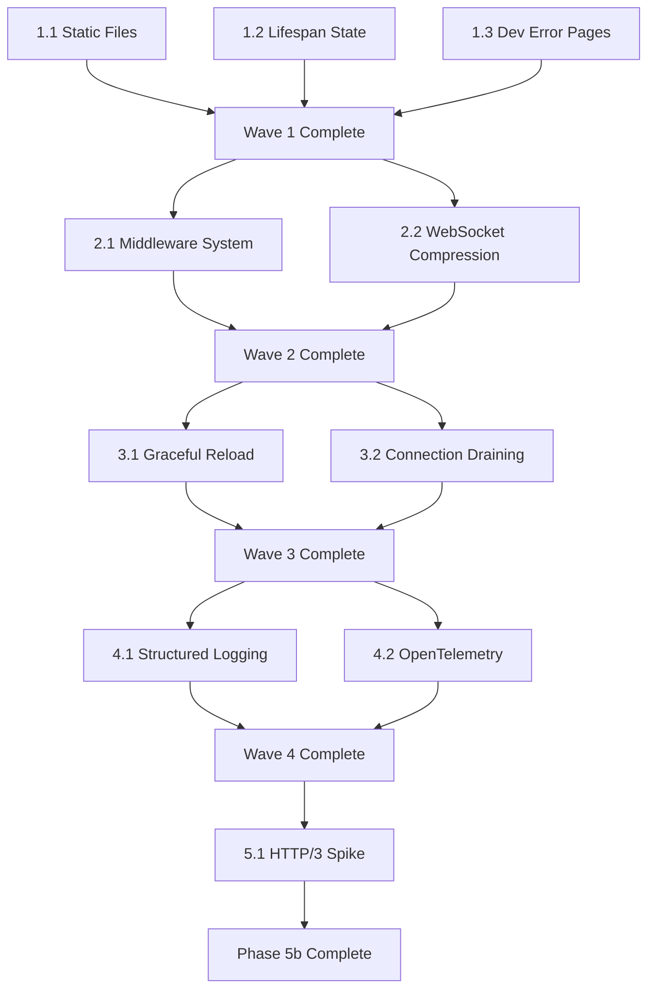

# Phase 5b Implementation Plan: Production Competitiveness

**Goal:** Make pounce a competitive alternative to Uvicorn/Hypercorn/Granian for production use in 2026, optimized for Bengal (SSG) and Chirp (hypermedia/HTMX) workloads.

**Status:** Phase 5a (Production Grade security/observability) completed. Phase 5b focuses on feature parity and DX.

---

## Overview

This phase adds 10 critical features across three categories:

1. **Production Features** (4): Static files, graceful reload, connection draining, structured logging
2. **ASGI Spec & Extensibility** (3): Lifespan state, middleware system, OTel integration
3. **Developer Experience** (2): Rich error pages, WebSocket compression
4. **Future Roadmap** (1): HTTP/3 spike

**Estimated Effort:** 4-6 weeks full-time (assuming 1-2 devs)

---

## Implementation Waves

### Wave 1: Foundation (Week 1-2)
**Dependencies:** None. These can be parallelized.

#### 1.1 Static File Serving ⭐ CRITICAL
- **Priority:** P0 — Blocks Bengal SSG deployments without Nginx
- **Complexity:** Medium (sendfile, ETag, Range requests)
- **Module:** `pounce/_static.py`
- **Tests:** 15+ tests, integration with Bengal site
- **Acceptance:** Serve full Bengal site with zero-copy, 304 responses

#### 1.2 ASGI Lifespan State ⭐ SPEC COMPLIANCE
- **Priority:** P0 — ASGI 3.0 spec compliance gap
- **Complexity:** Low (dict creation and scope injection)
- **Files:** `asgi/lifespan.py`, `asgi/bridge.py`, `asgi/h2_bridge.py`, `asgi/ws_bridge.py`
- **Tests:** 8+ tests
- **Acceptance:** Apps can share state from startup to requests

#### 1.3 Development Error Pages
- **Priority:** P0 for DX — Huge quality-of-life improvement
- **Complexity:** Medium (traceback capture, HTML rendering, Rosettes integration)
- **Module:** `pounce/_debug.py`
- **Tests:** 10+ tests, security tests (no leak in production)
- **Acceptance:** Rich tracebacks in dev mode, normal 500 in production

**Wave 1 Outcome:** Bengal deployable without Nginx, spec-compliant lifespan, excellent dev UX.

---

### Wave 2: Extensibility (Week 2-3)
**Dependencies:** Wave 1 (lifespan state should be available to middleware)

#### 2.1 Middleware Extension System ⭐ CRITICAL
- **Priority:** P0 — Enables Chirp middleware without forking
- **Complexity:** Medium (protocol design, execution chain)
- **Module:** `pounce/_middleware.py`
- **Built-ins:** CORS, SecurityHeaders (optional)
- **Tests:** 12+ tests, hook ordering, exception handling
- **Acceptance:** Apps can inject pre-request, post-response, exception hooks

#### 2.2 WebSocket Compression
- **Priority:** P1 (P0 if Chirp uses WS heavily)
- **Complexity:** Medium (wsproto extensions, negotiation)
- **Files:** `protocols/ws.py`, new config fields
- **Tests:** 8+ tests, compression ratio validation
- **Acceptance:** 60-80% bandwidth reduction on text messages

**Wave 2 Outcome:** Server is extensible, WS is production-ready for real-time HTMX.

---

### Wave 3: Production Operations (Week 3-4)
**Dependencies:** Wave 2 (middleware should be available for testing reload)

#### 3.1 Graceful Worker Reload ⭐ CRITICAL
- **Priority:** P0 — Production deployment requirement
- **Complexity:** High (rolling restart, drain coordination, multi-mode)
- **Files:** `supervisor.py`, `worker.py`, signal handling
- **Tests:** 15+ tests, zero-drop validation
- **Acceptance:** SIGHUP reloads code without dropping requests

#### 3.2 Enhanced Connection Draining
- **Priority:** P1 (P0 for Kubernetes)
- **Complexity:** Medium (already partial, needs polish)
- **Files:** `supervisor.py`, `worker.py`, shutdown protocol
- **Tests:** 10+ tests, Kubernetes termination scenarios
- **Acceptance:** Clean SIGTERM shutdown, force after timeout

**Wave 3 Outcome:** Production-ready deployment story for containers and bare metal.

---

### Wave 4: Observability (Week 4-5)
**Dependencies:** Wave 3 (reload and drain should emit structured events)

#### 4.1 Structured Lifecycle Event Logging
- **Priority:** P1 (P0 for large deployments)
- **Complexity:** Low (extend existing lifecycle system)
- **Files:** `lifecycle.py`, `logging.py`
- **Tests:** 8+ tests, JSON parsing validation
- **Acceptance:** Rich JSON logs correlatable across distributed systems

#### 4.2 OpenTelemetry Integration
- **Priority:** P1 (P0 for observability stacks)
- **Complexity:** High (optional dep, span creation, context propagation)
- **Module:** `pounce/_otel.py`
- **Tests:** 12+ tests, OTLP export validation
- **Acceptance:** Pounce requests appear in Jaeger/Datadog/Tempo

**Wave 4 Outcome:** Best-in-class observability for production debugging and monitoring.

---

### Wave 5: Future Roadmap (Week 5-6)
**Dependencies:** All of the above completed

#### 5.1 HTTP/3 Support Spike
- **Priority:** P1 (strategic, not urgent)
- **Complexity:** High (architectural research)
- **Deliverable:** Design doc + prototype
- **Tests:** Manual browser testing
- **Acceptance:** Clear implementation path or "not yet" decision

**Wave 5 Outcome:** Informed decision on HTTP/3 for Phase 5c or later.

---

## Dependencies Graph



---

## Testing Strategy

### Per-Feature Tests
- Unit tests (isolated module behavior)
- Integration tests (end-to-end with real ASGI apps)
- Security tests (no leaks, path traversal, injection)
- Performance tests (benchmarks vs baseline)

### Cross-Feature Integration
- Static files + compression (precompressed .gz/.zst)
- Middleware + error pages (middleware exceptions trigger rich pages)
- Reload + structured logging (reload events appear in logs)
- OTel + middleware (spans created for middleware hooks)

### Bengal & Chirp Integration
- Bengal SSG site served entirely by pounce (no Nginx)
- Chirp app with middleware, lifespan state, rich error pages
- HTMX streaming responses with Server-Timing headers
- WebSocket chat app with compression

---

## Configuration API Changes

New `ServerConfig` fields (all backward compatible with defaults):

```python
# Static files
static_files: dict[str, str] = {}  # mount_path -> directory
static_cache_control: str = "public, max-age=3600"

# Middleware
middleware: list[MiddlewareProtocol] = []

# WebSocket
websocket_compression: bool = True
websocket_max_message_size: int = 10_485_760  # 10 MB

# Reload
reload_timeout: float = 30.0  # Worker drain timeout

# Logging
log_slow_requests_threshold: float = 5.0  # seconds

# OpenTelemetry
otel_endpoint: str | None = None  # e.g., "http://localhost:4318"
```

---

## Documentation Updates

### New Pages
- `/docs/features/static-files/` — Configuration, caching, precompressed
- `/docs/features/middleware/` — Writing custom middleware, built-in CORS
- `/docs/deployment/reload/` — Dev reload vs graceful reload
- `/docs/deployment/observability/` — OTel integration, structured logs
- `/docs/development/error-pages/` — Rich tracebacks, debugging

### Updated Pages
- `/docs/get-started/` — Add static files quick start
- `/docs/configuration/` — New config fields
- `/docs/about/architecture/` — Middleware execution flow

---

## Rollout Strategy

### Alpha Release (After Wave 1)
- Static files + lifespan state + dev error pages
- Tag: `v0.2.0-alpha.1`
- Audience: Bengal/Chirp dogfooding

### Beta Release (After Wave 3)
- Add middleware, reload, WebSocket compression
- Tag: `v0.2.0-beta.1`
- Audience: Early adopters, production testing

### Stable Release (After Wave 4)
- Add structured logging, OTel
- Tag: `v0.2.0`
- Announcement: "Production-ready for 2026"

### Future Release (After Wave 5)
- HTTP/3 decision point
- Tag: `v0.3.0` (if H3 implemented) or `v0.2.1` (if deferred)

---

## Success Metrics

### Technical
- [ ] 500+ tests passing (currently ~426)
- [ ] 85%+ code coverage (currently ~80%)
- [ ] Zero regressions in existing benchmarks
- [ ] Static file serving within 10% of Nginx throughput
- [ ] Graceful reload with <1ms latency spike

### Product
- [ ] Bengal sites deployable without Nginx
- [ ] Chirp apps use middleware system (CORS, auth, rate limiting)
- [ ] At least 1 production deployment using OTel integration
- [ ] Positive feedback from 5+ external adopters

### Ecosystem
- [ ] Updated benchmarks showing parity with Uvicorn 0.38+
- [ ] Blog post: "Pounce 0.2: Production-Ready Free-Threading ASGI"
- [ ] Conference talk submission (PyCon 2026?)

---

## Open Questions

1. **Static files:** Should we support custom handlers (e.g., on-the-fly image resizing)? → NO, keep minimal
2. **Middleware:** Should we support ASGI middleware protocol (class-based)? → YES, add compat layer
3. **HTTP/3:** Is aioquic stable enough for production? → RESEARCH in Wave 5
4. **Reload:** Can thread-mode graceful reload work without full process restart? → PROBABLY NOT, document limitation
5. **OTel:** Should we vendor opentelemetry-api to avoid heavy deps? → NO, keep optional

---

## Risk Mitigation

### Performance Regression
- **Risk:** New features slow down hot path
- **Mitigation:** Benchmark every feature, keep fast paths unchanged (static files bypass ASGI, middleware is optional)

### API Instability
- **Risk:** Breaking changes to public API
- **Mitigation:** All new features are opt-in via config, existing apps work unchanged

### Scope Creep
- **Risk:** Feature requests expand beyond Phase 5b
- **Mitigation:** Strict adherence to P0 list, defer P1 items to Phase 5c

### HTTP/3 Complexity
- **Risk:** H3 takes 6+ months, blocks other work
- **Mitigation:** Wave 5 is research only, implementation deferred to Phase 5c if too complex

---

## Next Steps

1. **Review this plan** with Bengal/Chirp stakeholders
2. **Prioritize any adjustments** (e.g., bump WebSocket compression if Chirp needs it)
3. **Start Wave 1, task #1.1** (Static File Serving) immediately
4. **Parallel work:** Developer can start #1.2 (Lifespan State) while #1.1 is in progress
5. **Weekly check-ins** to track progress and adjust priorities

---

**Estimated Completion:** 4-6 weeks (1-2 devs), end of Q1 2026

**Target Release:** Pounce v0.2.0 — Production-ready for Bengal, Chirp, and general ASGI workloads
