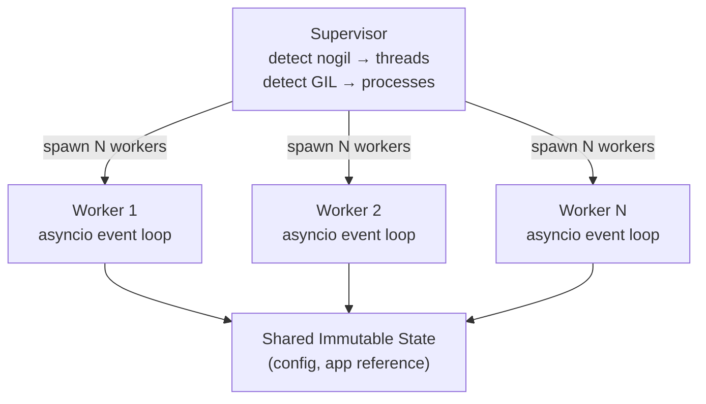

# ⟩⟩· pounce

A free-threading-native ASGI server for Python 3.14t.

```python
import pounce

pounce.run("myapp:app")
```

Pounce serves ASGI applications using real OS threads sharing a single interpreter — no
fork, no GIL, no per-process memory duplication. On Python 3.14t (free-threading), N worker
threads run N asyncio event loops in parallel, all sharing immutable config and route tables
with zero synchronization overhead.

**Status:** Phase 4 complete — HTTP/1.1, HTTP/2, WebSocket, TLS, multi-worker, zstd/gzip
compression, Server-Timing, streaming-first pipeline, dev reload, optional httptools backend.
31 source modules, 426 tests passing. See [ROADMAP.md](ROADMAP.md) for the full vision.

---

## Why Pounce?

Every existing ASGI server was built for a Python that had a GIL:

- **Uvicorn** runs one event loop per process. Parallelism means fork. Four workers means
  four copies of your app, your routes, your templates, your config — all in separate memory.
  It added Python 3.14 *compatibility* but not a free-threading-native worker model.
- **Granian** does its I/O in Rust and calls into Python for the ASGI app. It supports nogil
  threads, but the core server logic isn't Python.
- **Hypercorn** and **Daphne** are process-based. No free-threading awareness.

Pounce is built for the world that 3.14t creates. Three things no existing ASGI server
combines:

**Free-threading native.** Python 3.14t removes the GIL. For the first time, Python threads
execute in true parallel. Pounce runs N worker threads sharing one interpreter, one copy of
the application, one set of frozen route tables and config — all with zero synchronization
for immutable data.

**2026-native features.** Python 3.14 ships `compression.zstd` in the stdlib (PEP 784).
Pounce is the first ASGI server with zero-dependency zstd content-encoding — better
compression ratios than gzip, lower CPU cost, using pure stdlib. Server-Timing headers are
auto-injected for built-in observability.

**Streaming-first.** The dominant response patterns of 2026 — chunked HTML, event streams,
AI token delivery — are all streaming. Pounce's response pipeline sends body chunks
immediately to the socket, never buffered.

---

## Quick Start

### Programmatic

```python
import pounce

# Minimal — detects nogil, picks workers automatically
pounce.run("myapp:app")

# Configured
pounce.run(
    "myapp:app",
    host="0.0.0.0",
    port=8000,
    workers=4,
)
```

### Command Line

```bash
pounce myapp:app
pounce myapp:app --host 0.0.0.0 --port 8000 --workers 4
pounce myapp:app --ssl-certfile cert.pem --ssl-keyfile key.pem
pounce myapp:app --reload  # dev mode — auto-restart on source changes
pounce myapp:app --reload --reload-include ".html,.css,.md" --reload-dir ./templates
pounce myapp:create_app()  # app factory pattern
```

---

## How It Works



On **Python 3.14t** (free-threading): workers are threads. One process, N threads, each with
its own asyncio event loop. Shared memory, no fork overhead, no IPC.

On **GIL builds**: workers are processes. Same API, same config. The supervisor detects the
runtime via `sys._is_gil_enabled()` and adapts automatically.

A request flows through: socket accept → protocol parser (h11 or httptools) → ASGI scope
construction → `app(scope, receive, send)` → response serialization → socket write. The
bridge is per-request, created and destroyed within a single connection handler. No shared
mutable state.

---

## Protocols

| Protocol | Backend | Install |
|----------|---------|---------|
| HTTP/1.1 | h11 (pure Python, default) | built-in |
| HTTP/1.1 | httptools (C-accelerated) | `pounce[fast]` |
| HTTP/2 | h2 (stream multiplexing, priority signals) | `pounce[h2]` |
| WebSocket | wsproto (including WS over H2) | `pounce[ws]` |
| TLS | stdlib ssl + truststore | `pounce[tls]` |
| All | Everything above (except httptools) | `pounce[full]` |

**Compression** — content negotiation handles `zstd > gzip > identity` automatically. Zstd
uses Python 3.14's stdlib `compression.zstd` (PEP 784) — zero external dependencies.

**Server-Timing** — auto-injected when enabled. Measures request-to-response latency for
browser DevTools.

---

## Key Ideas

- **Free-threading first.** Threads, not processes. One interpreter, N event loops, shared
  immutable state. On GIL builds, falls back to multi-process automatically.
- **Pure Python.** No Rust, no C extensions in the server core. Debuggable, hackable,
  readable. Uses `h11` for HTTP parsing by default, with optional `httptools` backend
  (`pounce[fast]`) for C-accelerated performance.
- **Typed end-to-end.** Frozen config, typed ASGI definitions, zero `type: ignore` comments.
  `ty` passes clean.
- **One dependency.** `h11` for HTTP/1.1 parsing. HTTP/2 (`h2`), WebSocket (`wsproto`),
  TLS (`truststore`), and httptools (`pounce[fast]`) are optional extras.
- **Observable.** Every connection and request produces structured lifecycle events —
  frozen dataclasses with nanosecond timestamps. Plug in a `LifecycleCollector` to capture
  latency distributions, connection counts, and error rates without touching logging or
  middleware. Zero overhead when no collector is attached.
- **Chirp companion.** Built to serve Chirp apps natively, but works with any ASGI framework.

---

## Requirements

- Python >= 3.14

---

## Part of the Bengal Ecosystem

```
purr        Content runtime   (connects everything)
pounce      ASGI server       (serves apps)
chirp       Web framework     (serves HTML)
kida        Template engine   (renders HTML)
patitas     Markdown parser   (parses content)
rosettes    Syntax highlighter (highlights code)
bengal      Static site gen   (builds sites)
```

---

## License

MIT
