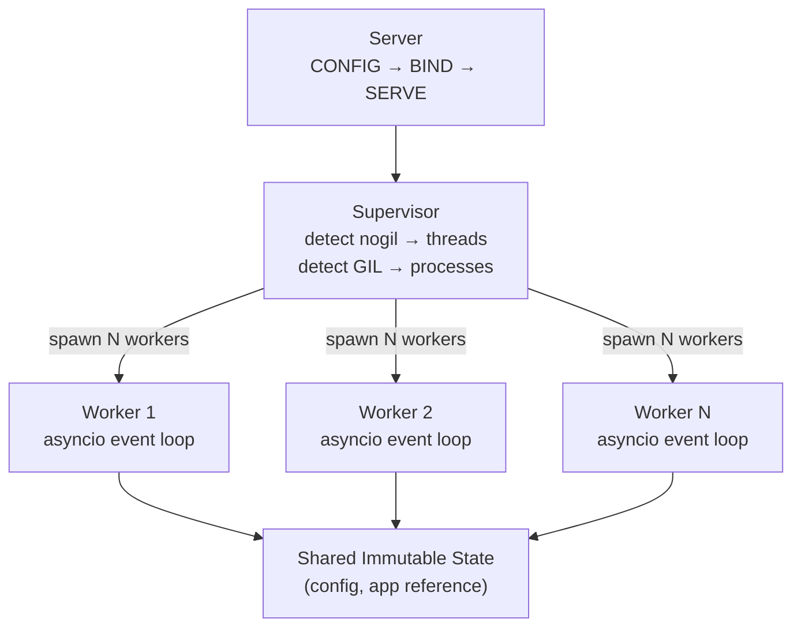
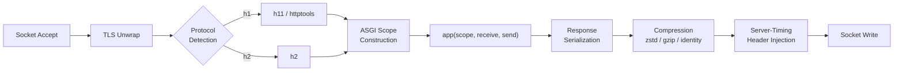

## Overview

Pounce follows a three-layer architecture: **Server** orchestrates lifecycle, **Supervisor** manages workers, and **Workers** handle requests. All layers share a single frozen `ServerConfig` — no synchronization needed.

## Server Layer

The `Server` class orchestrates the full lifecycle:

1. **CONFIG** — Validate and freeze `ServerConfig`
2. **DETECT** — Check for free-threading via `sys._is_gil_enabled()`
3. **BIND** — Create listening sockets with `SO_REUSEPORT`
4. **LIFESPAN** — Run ASGI lifespan protocol (`startup` / `shutdown`)
5. **SERVE** — Delegate to single-worker fast path or multi-worker supervisor
6. **SHUTDOWN** — Graceful connection draining, signal handling

For single-worker mode (`workers=1`), the server skips the supervisor entirely and runs the worker directly — no thread/process overhead.

## Supervisor Layer

The `Supervisor` manages worker lifecycle:

- **Spawn** — Creates N worker threads (nogil) or processes (GIL)
- **Monitor** — Health-check loop with automatic restart (max 5 restarts per 60s window)
- **Reload** — Graceful restart of all workers when `--reload` detects changes
- **Shutdown** — Signals all workers to stop, waits for connection draining

## Worker Layer

Each `Worker` runs its own asyncio event loop:

1. **Accept** — Receive TCP connections from the shared socket
2. **Parse** — Feed bytes to protocol parser (h11, h2, or wsproto)
3. **Bridge** — Build ASGI scope, create `receive`/`send` callables
4. **Dispatch** — Call `app(scope, receive, send)`
5. **Respond** — Serialize response and write to socket (streaming)

Workers are fully independent. No shared mutable state, no locks, no coordination between workers during request handling.

## Request Pipeline

A single HTTP request flows through:

The bridge is per-request — created and destroyed within a single connection handler. This ensures zero cross-request state leakage.

## Module Map

| Module | Layer | Purpose |
|--------|-------|---------|
| `server.py` | Server | Lifecycle orchestration |
| `supervisor.py` | Supervisor | Worker spawn/monitor |
| `worker.py` | Worker | asyncio loop, request handling |
| `config.py` | Shared | Frozen `ServerConfig` |
| `protocols/h1.py` | Protocol | HTTP/1.1 via h11 |
| `protocols/h1_httptools.py` | Protocol | HTTP/1.1 via httptools |
| `protocols/h2.py` | Protocol | HTTP/2 via h2 |
| `protocols/ws.py` | Protocol | WebSocket via wsproto |
| `asgi/bridge.py` | Bridge | HTTP ASGI scope/receive/send |
| `asgi/h2_bridge.py` | Bridge | HTTP/2 ASGI bridge |
| `asgi/ws_bridge.py` | Bridge | WebSocket ASGI bridge |
| `asgi/lifespan.py` | Bridge | ASGI lifespan protocol |
| `net/listener.py` | Network | Socket bind, SO_REUSEPORT |
| `net/tls.py` | Network | TLS context creation |

## See Also

- [[docs/about/thread-safety|Thread Safety]] — How shared state works
- [[docs/about/performance|Performance]] — Streaming-first design
- [[docs/protocols|Protocols]] — Protocol handler details
