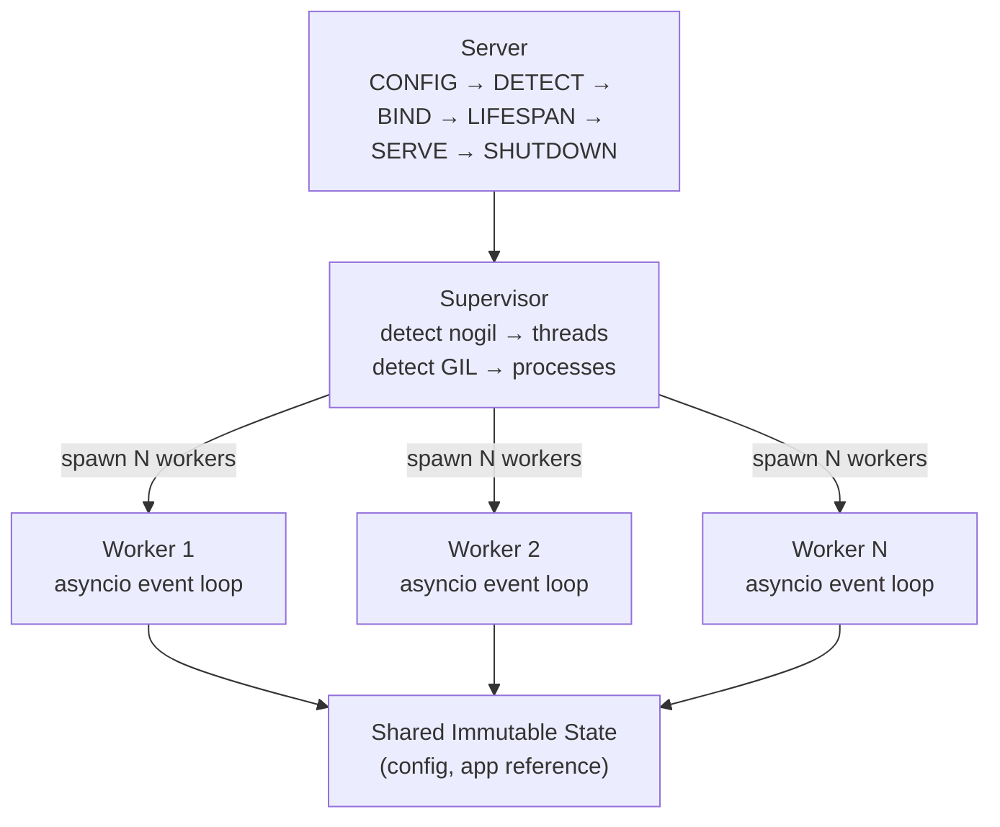
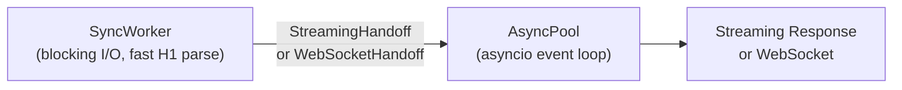
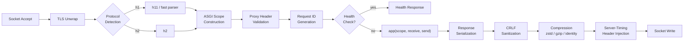

## Overview

Pounce follows a three-layer architecture: **Server** orchestrates lifecycle, **Supervisor** manages workers, and **Workers** handle requests. All layers share a single frozen `ServerConfig` — no synchronization needed.

## Server Layer

The `Server` class orchestrates the full lifecycle:

:::{steps}
:::{step} CONFIG

Validate and freeze `ServerConfig`.

:::{/step}
:::{step} DETECT

Check for free-threading via `sys._is_gil_enabled()`.

:::{/step}
:::{step} BIND

Create listening sockets with `SO_REUSEPORT`.

:::{/step}
:::{step} LIFESPAN

Run ASGI lifespan protocol (`startup` / `shutdown`).

:::{/step}
:::{step} SERVE

Delegate to single-worker fast path or multi-worker supervisor.

:::{/step}
:::{step} SHUTDOWN

Graceful connection draining, signal handling.

:::{/step}
:::{/steps}

For single-worker mode (`workers=1`), the server skips the supervisor entirely and runs the worker directly — no thread/process overhead.

## Supervisor Layer

The `Supervisor` manages worker lifecycle:

- **Spawn** — Creates N worker threads (nogil) or processes (GIL)
- **Monitor** — Health-check loop with automatic restart (max 5 restarts per 60s window)
- **Reload** — Graceful restart of all workers when `--reload` detects changes
- **Shutdown** — Signals all workers to stop, waits for connection draining

## Worker Layer

Each `Worker` runs its own asyncio event loop:

:::{steps}
:::{step} Accept

Receive TCP connections from the shared socket.

:::{/step}
:::{step} Parse

Feed bytes to protocol parser (h11, h2, or wsproto).

:::{/step}
:::{step} Bridge

Build ASGI scope, create `receive`/`send` callables.

:::{/step}
:::{step} Dispatch

Call `app(scope, receive, send)`.

:::{/step}
:::{step} Respond

Serialize response and write to socket (streaming).

:::{/step}
:::{/steps}

Workers are fully independent. No shared mutable state or cross-worker coordination during request handling.

### Sync Worker Fast Path (3.14t)

On free-threaded Python, pounce also supports **sync workers** — blocking I/O
without an asyncio event loop. Sync workers use the built-in fast HTTP/1.1
parser for simple request/response cycles.

When a response requires streaming or WebSocket upgrade, the sync worker hands off to a dedicated **AsyncPool** thread via a typed handoff object:

This hybrid model means asyncio overhead is only paid when needed.

## Request Pipeline

A single HTTP request flows through:

The bridge is per-request — created and destroyed within a single connection handler. This ensures zero cross-request state leakage.

::::{dropdown} Module Map

| Module | Layer | Purpose |
|--------|-------|---------|
| `server.py` | Server | Lifecycle orchestration |
| `supervisor.py` | Supervisor | Worker spawn/monitor |
| `worker.py` | Worker | asyncio loop, request handling |
| `config.py` | Shared | Frozen `ServerConfig` |
| `protocols/h1.py` | Protocol | HTTP/1.1 via h11 |
| `protocols/h2.py` | Protocol | HTTP/2 via h2 |
| `protocols/h3.py` | Protocol | HTTP/3 via bengal-zoomies |
| `protocols/ws.py` | Protocol | WebSocket via wsproto |
| `_fast_h1.py` | Protocol | Fast H1 parser (~3 µs/req) |
| `asgi/bridge.py` | Bridge | HTTP ASGI scope/receive/send |
| `asgi/h2_bridge.py` | Bridge | HTTP/2 ASGI bridge |
| `asgi/ws_bridge.py` | Bridge | WebSocket ASGI bridge |
| `asgi/lifespan.py` | Bridge | ASGI lifespan protocol |
| `net/listener.py` | Network | Socket bind, SO_REUSEPORT, UDS |
| `net/tls.py` | Network | TLS context creation |
| `_proxy.py` | Security | Proxy header validation |
| `_request_id.py` | Observability | Request ID generation/extraction |
| `_health.py` | Observability | Built-in health check endpoint |
| `metrics.py` | Observability | Prometheus-compatible metrics |
| `sync_worker.py` | Worker | Blocking I/O worker with fast H1 parse |
| `async_pool.py` | Worker | Async handoff for streaming/WS |
| `accept_distributor.py` | Network | Thundering herd elimination |
| `_state.py` | Lifecycle | Elm Architecture state machine |
| `lifecycle.py` | Observability | Typed lifecycle events (public API) |
| `_bench.py` | CLI | Built-in benchmark runner |

::::

## See Also

- [[docs/about/thread-safety|Thread Safety]] — How shared state works
- [[docs/about/performance|Performance]] — Streaming-first design
- [[docs/protocols|Protocols]] — Protocol handler details
