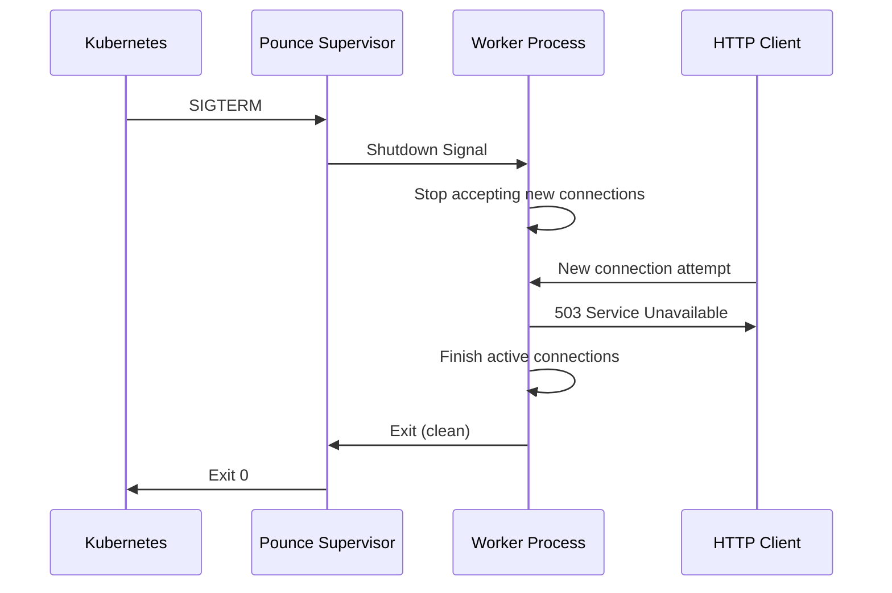

Pounce provides **production-grade graceful shutdown** with automatic connection draining, making it safe for Kubernetes, AWS, and other orchestration platforms that rely on clean SIGTERM handling.

## Overview

When pounce receives a shutdown signal (SIGTERM or SIGINT), it:

1. **Stops accepting new connections** immediately
2. **Finishes processing active connections** (up to `shutdown_timeout`)
3. **Force-terminates** workers that don't drain in time
4. **Exits cleanly** with appropriate status codes

This ensures **zero dropped requests** during rolling deployments, scaling operations, and graceful shutdowns.

## Quick Start

### Basic Configuration

```python
from pounce import ServerConfig

config = ServerConfig(
    host="0.0.0.0",
    port=8000,
    shutdown_timeout=30.0,  # Wait up to 30s for connections to drain
)
```

### Kubernetes Deployment

```yaml
apiVersion: apps/v1
kind: Deployment
metadata:
  name: pounce-app
spec:
  replicas: 3
  template:
    spec:
      containers:
      - name: app
        image: myapp:latest
        ports:
        - containerPort: 8000
        # Kubernetes graceful shutdown configuration
        lifecycle:
          preStop:
            exec:
              # Optional: Send custom shutdown signal or delay
              command: ["sh", "-c", "sleep 5"]
      # Give pounce time to drain connections
      terminationGracePeriodSeconds: 40
```

**Key settings:**
- `terminationGracePeriodSeconds`: Should be **greater than** `shutdown_timeout` + safety margin
- `preStop` hook (optional): Add delay for load balancer de-registration

## How It Works

### Shutdown Sequence



### 1. Signal Reception

When the supervisor receives SIGTERM:

```python
# Supervisor receives signal
logger.info("Received SIGTERM — initiating shutdown")
shutdown_event.set()
```

### 2. Connection Draining

Workers immediately:
- **Reject new connections** with 503 status
- **Continue processing** existing requests
- **Log drain progress**

```
Worker 1 draining 3 active connection(s)...
Worker 2 shutting down (no active connections)
```

### 3. Timeout Enforcement

After `shutdown_timeout`, workers that haven't exited are force-terminated:

```
Worker 1 did not stop within shutdown_timeout (30.0s) — force terminating
```

## Configuration

### shutdown_timeout

Maximum time to wait for connections to drain before force-terminating workers.

```python
config = ServerConfig(
    shutdown_timeout=30.0,  # seconds
)
```

**Recommendations:**
- **Development**: 5-10 seconds
- **Production**: 30-60 seconds
- **Long-running requests**: Match your longest expected request duration + buffer

### Validation

The timeout must be positive:

```python
# Valid
ServerConfig(shutdown_timeout=30.0)

# Invalid
ServerConfig(shutdown_timeout=0.0)   # ValueError
ServerConfig(shutdown_timeout=-5.0)  # ValueError
```

## Kubernetes Best Practices

### 1. terminationGracePeriodSeconds

Set this **higher** than your `shutdown_timeout`:

```yaml
spec:
  terminationGracePeriodSeconds: 40  # shutdown_timeout (30) + 10s buffer
```

If Kubernetes's grace period expires before pounce finishes draining, Kubernetes sends SIGKILL and **forcibly terminates** the pod, potentially dropping connections.

### 2. preStop Hook (Optional)

Add a delay to allow load balancers to de-register the pod before shutdown starts:

```yaml
lifecycle:
  preStop:
    exec:
      command: ["sh", "-c", "sleep 5"]
```

This prevents new connections from being routed to the pod after shutdown begins.

### 3. Readiness Probe

Use a readiness probe to stop receiving traffic before shutdown:

```yaml
readinessProbe:
  httpGet:
    path: /health
    port: 8000
  initialDelaySeconds: 5
  periodSeconds: 5
```

Pounce's built-in health check:

```python
config = ServerConfig(
    health_check_path="/health",  # Automatic 200 OK endpoint
)
```

### 4. Complete Example

```yaml
apiVersion: apps/v1
kind: Deployment
metadata:
  name: pounce-app
spec:
  replicas: 3
  strategy:
    type: RollingUpdate
    rollingUpdate:
      maxUnavailable: 1
      maxSurge: 1
  template:
    metadata:
      labels:
        app: pounce-app
    spec:
      containers:
      - name: app
        image: mycompany/myapp:v1.2.3
        ports:
        - containerPort: 8000
          name: http
        env:
        - name: SHUTDOWN_TIMEOUT
          value: "30"
        readinessProbe:
          httpGet:
            path: /health
            port: 8000
          initialDelaySeconds: 5
          periodSeconds: 3
          failureThreshold: 2
        livenessProbe:
          httpGet:
            path: /health
            port: 8000
          initialDelaySeconds: 15
          periodSeconds: 10
        lifecycle:
          preStop:
            exec:
              command: ["sh", "-c", "sleep 5"]
        resources:
          requests:
            memory: "256Mi"
            cpu: "100m"
          limits:
            memory: "512Mi"
            cpu: "500m"
      terminationGracePeriodSeconds: 40
---
apiVersion: v1
kind: Service
metadata:
  name: pounce-app
spec:
  type: ClusterIP
  ports:
  - port: 80
    targetPort: 8000
  selector:
    app: pounce-app
```

## Docker Best Practices

### 1. Handle Signals Properly

Use `exec` form of CMD to ensure signals reach pounce:

```dockerfile
# Good - signals reach pounce directly
CMD ["pounce", "myapp:app"]

# Bad - shell doesn't forward signals
CMD pounce myapp:app
```

### 2. Run as Non-Root

```dockerfile
FROM python:3.14-slim

RUN useradd -m -u 1000 app
USER app

# Install deps
WORKDIR /app
COPY --chown=app:app . .
RUN pip install --user pounce

# Run server
CMD ["pounce", "myapp:app", "--host", "0.0.0.0"]
```

### 3. Health Checks

```dockerfile
HEALTHCHECK --interval=30s --timeout=3s --start-period=5s --retries=3 \
  CMD curl -f http://localhost:8000/health || exit 1
```

## AWS ECS / Fargate

### Task Definition

```json
{
  "family": "pounce-app",
  "containerDefinitions": [
    {
      "name": "app",
      "image": "mycompany/myapp:latest",
      "portMappings": [
        {
          "containerPort": 8000,
          "protocol": "tcp"
        }
      ],
      "environment": [
        {
          "name": "SHUTDOWN_TIMEOUT",
          "value": "30"
        }
      ],
      "healthCheck": {
        "command": ["CMD-SHELL", "curl -f http://localhost:8000/health || exit 1"],
        "interval": 30,
        "timeout": 5,
        "retries": 3,
        "startPeriod": 60
      },
      "stopTimeout": 40
    }
  ]
}
```

**Key setting:** `stopTimeout` should be greater than `shutdown_timeout`.

## Systemd Service

```ini
[Unit]
Description=Pounce ASGI Server
After=network.target

[Service]
Type=notify
User=www-data
Group=www-data
WorkingDirectory=/var/www/myapp
Environment="PATH=/var/www/myapp/venv/bin"
ExecStart=/var/www/myapp/venv/bin/pounce myapp:app --host 0.0.0.0 --port 8000
Restart=on-failure
RestartSec=5s

# Graceful shutdown
KillMode=mixed
KillSignal=SIGTERM
TimeoutStopSec=40s

[Install]
WantedBy=multi-user.target
```

**Key settings:**
- `KillSignal=SIGTERM`: Proper shutdown signal
- `TimeoutStopSec`: Greater than `shutdown_timeout`
- `KillMode=mixed`: SIGTERM to main process, SIGKILL to children after timeout

## Monitoring Shutdown

### Logs

Pounce logs the complete shutdown sequence:

```
[2026-02-12 10:15:30] Received SIGTERM — initiating shutdown
[2026-02-12 10:15:30] Shutting down 4 worker(s)...
[2026-02-12 10:15:30] Worker 1 draining 2 active connection(s)...
[2026-02-12 10:15:30] Worker 2 shutting down (no active connections)
[2026-02-12 10:15:32] Worker 2 stopped
[2026-02-12 10:15:33] Worker 1 stopped
[2026-02-12 10:15:33] All workers stopped
```

## Troubleshooting

### Workers Not Draining in Time

**Symptom:** Logs show force termination:

```
Worker 1 did not stop within shutdown_timeout (30.0s) — force terminating
```

**Solutions:**

1. **Increase timeout:**
   ```python
   config = ServerConfig(shutdown_timeout=60.0)
   ```

2. **Reduce request duration:** Optimize slow endpoints

3. **Add request timeout:**
   ```python
   config = ServerConfig(
       request_timeout=25.0,  # Cancel slow requests
       shutdown_timeout=30.0,
   )
   ```

### Kubernetes SIGKILL Before Drain Complete

**Symptom:** Pods terminated before connections finish

**Solution:** Increase `terminationGracePeriodSeconds`:

```yaml
spec:
  terminationGracePeriodSeconds: 60  # Must be > shutdown_timeout
```

### Load Balancer Still Routing to Draining Pod

**Symptom:** New requests to shutting-down pods

**Solution:** Add preStop delay:

```yaml
lifecycle:
  preStop:
    exec:
      command: ["sh", "-c", "sleep 10"]
```

This allows time for load balancer health checks to fail and de-register the pod.

### Dropped Connections During Rolling Update

**Symptom:** Intermittent 503 errors during deployments

**Checklist:**

1. `terminationGracePeriodSeconds` > `shutdown_timeout`
2. Readiness probe configured
3. preStop delay added (5-10s)
4. Rolling update strategy configured:
   ```yaml
   strategy:
     type: RollingUpdate
     rollingUpdate:
       maxUnavailable: 0  # Keep all pods running during update
       maxSurge: 1
   ```

## Testing Graceful Shutdown

### Local Testing

```bash
# Start server
pounce myapp:app &
PID=$!

# Make a long-running request in background
curl http://localhost:8000/slow-endpoint &

# Send SIGTERM
kill -TERM $PID

# Watch logs - should see:
# "Worker 1 draining 1 active connection(s)..."
# "Worker 1 stopped"
```

### Load Testing

Use wrk or hey to test under load:

```bash
# Terminal 1: Start server
pounce myapp:app

# Terminal 2: Generate load
hey -z 60s http://localhost:8000/

# Terminal 3: Send SIGTERM after 10s
sleep 10 && pkill -TERM pounce

# Check: No connection errors in hey output
```

## See Also

- [Graceful Reload](./graceful-reload) — Zero-downtime code updates
- [Production Deployment](./production) — Complete production guide
- [Observability](./observability) — Monitor shutdown metrics
