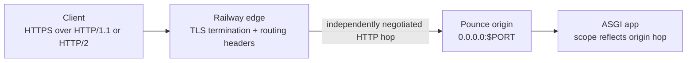

Railway public networking expects the web process to listen on the
Railway-provided `PORT` variable on `0.0.0.0`. Railway terminates public
TLS at the platform edge for HTTP services, so the usual Pounce deployment is
plain HTTP inside the container with `trusted_hosts` configured only after you
confirm the ingress peer addresses for your service.

Platform behavior in this page was last checked against Railway's public docs
on 2026-07-08. Verify mutable networking details against the linked references
and your service's request logs before changing a trust boundary.

## Request Path And Protocol Hops



The two HTTP legs are independent:

| Leg | Contract |
|---|---|
| Client → Railway edge | Railway public networking accepts HTTPS and documents HTTP/1.1 and HTTP/2 client traffic. The edge owns the public certificate and TLS session. |
| Railway edge → Pounce | The edge selects an origin protocol independently. In the production incidents [#231](https://github.com/lbliii/pounce/issues/231) and [#232](https://github.com/lbliii/pounce/issues/232), this leg used HTTP/2 even when the external client used HTTP/1.1. Treat that as observed evidence, not a permanent platform guarantee. |
| Pounce → ASGI app | `scope["http_version"]`, `scope["scheme"]`, `scope["client"]`, and `scope["server"]` describe Pounce's origin connection after trusted-proxy normalization. They do not reveal the client's protocol to the edge. |

Install the HTTP/2 extra when the Railway origin leg may negotiate HTTP/2:

```bash
uv add "bengal-pounce[h2]"
```

Confirm the actual origin protocol from Pounce access/lifecycle logs or a
diagnostic app that records `scope["http_version"]`; do not infer it from
`curl --http1.1` or the browser's client-side protocol.

## Start Command

Use a small entrypoint when your app needs programmatic config:

```python
# railway_app.py
import os

import pounce
from myapp import app


if __name__ == "__main__":
    pounce.run(
        app,
        host="0.0.0.0",
        port=int(os.environ["PORT"]),
        workers=2,
        health_check_path="/readyz",
        shutdown_timeout=10,
        log_format="json",
        access_log=False,
    )
```

Then set the Railway start command to:

```bash
python railway_app.py
```

For a plain import-string app that does not need custom `ServerConfig` values:

```bash
pounce serve --app myapp:app --host 0.0.0.0 --port "$PORT" --workers 2 --health-check-path /readyz --shutdown-timeout 10 --log-format json --no-access-log
```

A complete deployment bundle lives at
[examples/deploy/railway](https://github.com/lbliii/pounce/tree/main/examples/deploy/railway).
It includes a CPython 3.14t Dockerfile, a GIL-off boot assertion,
`railway.toml`, the app/config example, and a smoke runner that proves initial
deployment plus continuous fast and slow traffic through a graceful redeploy.
The adjacent `Dockerfile.canary` installs the current repository checkout for
the public main-branch canary; the release Dockerfile remains pinned to a
published package version so those two proof claims cannot be confused.
The earlier [single-file example](https://github.com/lbliii/pounce/blob/main/examples/railway_deploy.py)
remains as a compatibility entrypoint.

## Health Checks

Configure Railway's healthcheck path to `/readyz`, matching
`health_check_path="/readyz"`. Railway uses the service `PORT` for healthcheck
traffic, and healthchecks gate deployment activation rather than continuous
monitoring.

If your application rejects unexpected hostnames, allow
`healthcheck.railway.app` for the health endpoint.

## TLS And HTTP/3

Do not set `ssl_certfile`, `ssl_keyfile`, or `http3_enabled=True` for Railway
public HTTP unless you have a separate raw UDP/TCP networking design. Railway's
public HTTP path provides platform TLS and forwards HTTP traffic to the process
port.

Inside the ASGI scope, `scope["scheme"]` will be `http` unless you configure
trusted proxy headers and Railway forwards `X-Forwarded-Proto`. Keep
`trusted_hosts` empty until the ingress trust boundary for the deployment is
known; untrusted `X-Forwarded-*` headers are stripped by default.

Choose TLS ownership by network path:

| Path | Pounce configuration |
|---|---|
| Railway public HTTP/HTTPS | Edge terminates TLS. Leave `ssl_certfile`, `ssl_keyfile`, and `http3_enabled` unset; Pounce speaks HTTP on `$PORT`. |
| Railway private networking | Connect to `http://<service>.railway.internal:<port>`. Railway documents the private mesh as WireGuard-encrypted; no public edge or forwarded-header identity is involved. |
| Railway TCP Proxy or another raw TCP path | Pounce may terminate TLS and negotiate ALPN itself, but this is a separate design from Railway public HTTP. TCP proxying does not provide Pounce's UDP listener for HTTP/3. |

## Trusted Proxy Worked Example

Proxy trust controls application-visible identity; it does not change the
origin protocol. Start fail-closed:

```python
from pounce import ServerConfig

config = ServerConfig(
    host="0.0.0.0",
    port=8000,
    trusted_hosts=frozenset(),  # default: strip X-Forwarded-* headers
)
```

After request logs or platform support confirm the direct ingress peer address,
trust only that peer and set the number of trusted hops:

```python
config = ServerConfig(
    host="0.0.0.0",
    port=8000,
    trusted_hosts=frozenset({"10.0.0.12"}),  # example; replace with observed peer
    forwarded_for_trusted_hops=1,
)
```

The equivalent `pounce.toml` fragment is:

```toml
trusted_hosts = ["10.0.0.12"] # example; replace with observed peer
forwarded_for_trusted_hops = 1
```

For the default one-hop case, the CLI also accepts a comma-separated peer
allowlist:

```bash
pounce serve --app myapp:app --host 0.0.0.0 --port "$PORT" \
    --trusted-hosts 10.0.0.12
```

Do not copy the example address. Do not use `*` merely because an edge address
is inconvenient to discover: wildcard trust makes a directly reachable Pounce
listener accept client-supplied forwarded identity.

::::{warning}
Frameworks that embed Pounce must forward both `trusted_hosts` and
`forwarded_for_trusted_hops` into `ServerConfig`. Reading raw forwarded headers
inside application auth or rate limiting is not an equivalent trust boundary.
The broader embedding-surface audit is tracked in
[#247](https://github.com/lbliii/pounce/issues/247).
::::

### What Each Header Changes

Pounce applies these values only when the direct peer matches `trusted_hosts`:

| Header | Pounce behavior |
|---|---|
| `X-Forwarded-For` | Replaces `scope["client"]` with the entry selected from the right by `forwarded_for_trusted_hops`. If the header is absent, the direct peer remains the client. |
| `X-Forwarded-Proto` | Replaces `scope["scheme"]` when the value is `http`, `https`, `ws`, or `wss`. |
| `X-Forwarded-Host` | Replaces `scope["server"]` and the ASGI `Host` header, including a forwarded port. This is the authority host-routed tenant apps see. |
| `X-Request-ID` | Supplies the request ID only from a trusted direct peer; otherwise Pounce generates one. |

Railway's current public-networking specification documents `X-Real-IP`,
`X-Forwarded-Proto`, and `X-Forwarded-Host`. Pounce does **not** consume
`X-Real-IP` as client identity. It remains an ordinary application-visible
header, so do not feed it directly into auth or rate limiting. Pounce can
normalize `scope["client"]` only when the verified edge supplies
`X-Forwarded-For`; otherwise keep edge-derived client identity at the edge or
add deployment-specific middleware with its own verified trust boundary.

## Graceful Deploys

Set Pounce shutdown and Railway drain windows together. The checked-in
`railway.toml` expresses these values directly:

```toml
[deploy]
overlapSeconds = 5
drainingSeconds = 15
```

```python
pounce.run(
    app,
    host="0.0.0.0",
    port=int(os.environ["PORT"]),
    shutdown_timeout=10,
    health_check_path="/readyz",
)
```

The Railway drain window must be longer than Pounce's `shutdown_timeout` so
in-flight requests can finish before the platform sends a hard kill. Railway's
default drain is zero seconds, so omitting this setting forfeits graceful
shutdown even when the server handles `SIGTERM` correctly.

## Smoke Proof

### Every-merge main canary

The repository maintainer runs a best-effort public canary at
<https://pounce-railway-smoke-production.up.railway.app>. Railway watches the
GitHub `main` branch and builds `examples/deploy/railway/Dockerfile.canary` from
the repository root. The app reports the non-secret Railway git commit and
deployment channel alongside its Pounce/Python versions and GIL state.

On every merge, `.github/workflows/railway-main-canary.yml` waits until the
public app serves that exact commit, then checks `/readyz`, a normal request, a
slow request, and a finite SSE stream. The workflow uses no Railway credential;
deployment remains Railway-owned and the independent check observes only the
public origin. This is canary evidence for unreleased `main`, not a release or
uptime guarantee.

### Full deploy and redeploy proof

Run the bundled proof against an explicit Railway project, environment,
service, and public origin:

```bash
python examples/deploy/railway/smoke.py \
  --project PROJECT_ID \
  --environment production \
  --service SERVICE_ID \
  --origin https://SERVICE.up.railway.app
```

The runner does not infer a linked target. It uploads the recipe, waits for the
new deployment to reach terminal `SUCCESS`, checks `/readyz`, confirms the
container reports `gil_enabled=false`, then uploads a second deployment while
continuously probing fast and slow requests. It exits nonzero on any dropped
request or failed deployment.

For deployments that enable and protect `/_pounce/info`, set
`POUNCE_BUILD_ID` to the git SHA or immutable release fingerprint injected by
your delivery pipeline. The endpoint returns that value verbatim alongside the
Pounce version, Python build, free-threaded capability, runtime GIL state, and
resolved worker model. Do not place secrets in `POUNCE_BUILD_ID`, and do not
expose the introspection path publicly without reverse-proxy controls.

## Long-lived SSE

Pounce treats an open SSE response as active work: `header_timeout`,
`request_timeout`, and `keep_alive_timeout` do not reap it. Send a lightweight
SSE comment heartbeat such as `: keepalive\n\n` every 15–30 seconds for
intermediaries that close silent connections. This does not override
Railway's documented 15-minute maximum request duration; EventSource clients
must reconnect and use event IDs/backfill when continuity matters. See
[Railway's SSE and WebSocket guide](https://docs.railway.com/guides/sse-vs-websockets).

## Multi-Tenant Host Routing

For Chirp or LB Sonic style host routing, prefer deriving tenant identity from
the ASGI `Host` header. Pounce preserves the request `Host` directly, and when
a trusted proxy supplies `X-Forwarded-Host`, Pounce rewrites both the ASGI
`Host` header and `scope["server"]` to that forwarded authority.

Confirm the actual Railway ingress headers for your deployed service before
enabling `trusted_hosts`. If those details are unknown, leave `trusted_hosts`
empty and route tenants from the normal `Host` header.

Frameworks that construct `ServerConfig` on behalf of the app should also use
the [[docs/deployment/embedding|Framework Embedding]] checklist so body limits,
lifecycle bounds, and proxy trust reach Pounce instead of stopping at the
framework config.

## References

- [Railway Edge Networking](https://docs.railway.com/networking/edge-networking)
- [Railway Public Networking](https://docs.railway.com/networking/public-networking)
- [Railway Public Networking Specs & Limits](https://docs.railway.com/networking/public-networking/specs-and-limits)
- [Railway Private Networking](https://docs.railway.com/networking/private-networking/how-it-works)
- [Railway Healthchecks](https://docs.railway.com/deployments/healthchecks)
- [Railway Variables Reference](https://docs.railway.com/reference/variables)
- [Railway Deployment Teardown](https://docs.railway.com/deployments/deployment-teardown)
- [Railway Config as Code](https://docs.railway.com/config-as-code/reference)
