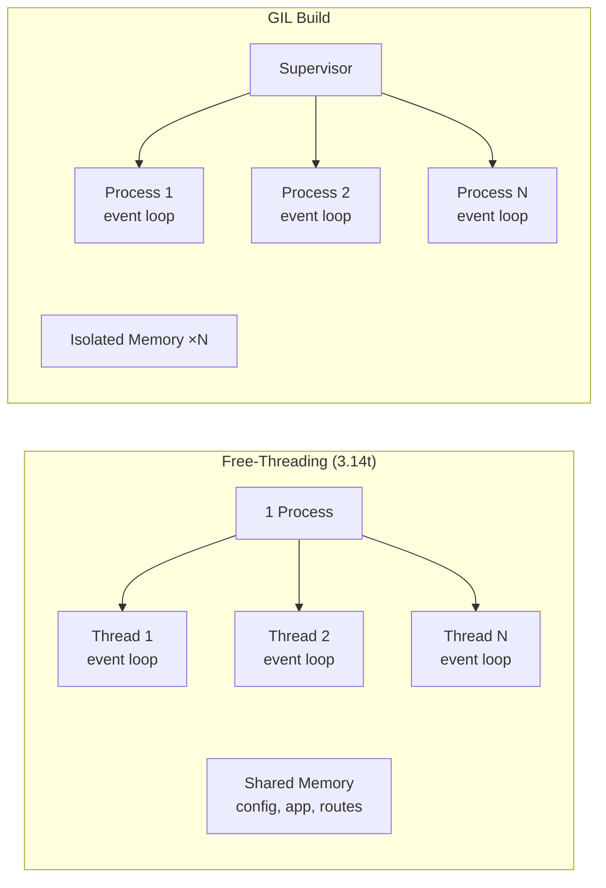

## Worker Modes

Pounce automatically selects the worker mode based on the Python runtime:

| Runtime | Workers Are | Detection |
|---------|-----------|-----------|
| Python 3.14t (free-threading) | Threads | `sys._is_gil_enabled()` returns `False` |
| Standard CPython (GIL) | Processes | `sys._is_gil_enabled()` returns `True` |

You don't need to configure this — the supervisor detects it at startup.

## Configuring Worker Count

```bash
# Single worker (no supervisor, lowest overhead)
pounce myapp:app --workers 1

# Auto-detect from CPU cores
pounce myapp:app --workers 0

# Explicit count
pounce myapp:app --workers 4
```

### Single Worker (workers=1)

The server skips the supervisor entirely and runs the worker directly in the main thread. This is the lowest-overhead mode — no supervisor thread, no health monitoring. Good for development and low-traffic services.

### Auto-Detect (workers=0)

Calls `os.cpu_count()` and uses that as the worker count (minimum 1). On an 8-core machine, this creates 8 workers.

### Multi-Worker (workers=2+)

The supervisor spawns N workers and monitors their health. Workers that crash are automatically restarted (max 5 restarts per 60-second window).

## Thread vs Process Workers



## Thread Workers (Free-Threading)

On Python 3.14t, each worker is a thread with its own asyncio event loop:

- **Shared memory** — All workers see the same `ServerConfig`, app reference, and route tables
- **No IPC** — Threads communicate through shared memory, not pipes
- **Lower memory** — One copy of the application, not N copies
- **SO_REUSEPORT** — Kernel distributes incoming connections across workers

## Process Workers (GIL)

On GIL builds, each worker is a separate process:

- **Isolated memory** — Each process has its own copy of everything
- **Fork-based** — Similar to Uvicorn/Gunicorn multi-process model
- **Higher memory** — N copies of the application

## Tuning Guidelines

| Workload | Recommended Workers |
|----------|-------------------|
| CPU-bound (computation) | `os.cpu_count()` (workers=0) |
| I/O-bound (database, network) | `os.cpu_count() * 2` |
| Development | `1` (single worker) |
| Mixed | `os.cpu_count()` (start here, tune) |

:::{tip}
Start with `--workers 0` (auto-detect) and monitor. Adjust based on actual CPU utilization and latency metrics.
:::

## Health Monitoring

The supervisor runs a health-check loop for multi-worker mode:

- Workers that crash are restarted automatically
- Maximum 5 restarts per 60-second window (prevents restart loops)
- Graceful shutdown signals all workers before exit

## See Also

- [[docs/about/thread-safety|Thread Safety]] — Shared state model
- [[docs/about/architecture|Architecture]] — Supervisor design
- [[docs/deployment/production|Production]] — Full production setup
