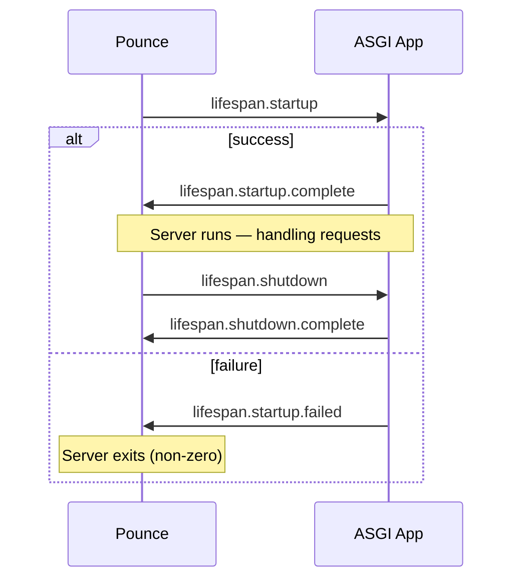

## Overview

The ASGI bridge is the layer between Pounce's protocol parsers and your ASGI application. It constructs the `scope` dict, creates `receive` and `send` callables, and manages the per-request lifecycle.

## HTTP Bridge

For HTTP requests, the bridge:

1. **Builds scope** — Extracts method, path, headers, query string from the parsed request
2. **Validates proxy headers** — Applies `X-Forwarded-*` from trusted peers, strips from untrusted
3. **Generates request ID** — UUID4 hex or honoured from trusted proxy's `X-Request-ID`
4. **Creates receive** — Returns request body chunks as `http.request` events
5. **Creates send** — Accepts `http.response.start` and `http.response.body` events, sanitises response headers (CRLF stripping), injects `X-Request-ID`
6. **Tracks state** — Monitors response status, headers sent, body complete

```python
# Simplified flow
scope = build_scope(request, config)       # + proxy header validation
request_id = extract_or_generate(headers)  # UUID4 or from trusted proxy
receive = create_receive(request_body)
send = create_send(connection, config, request_id=request_id)

await app(scope, receive, send)
```

## Scope Construction

The ASGI scope follows the ASGI HTTP Connection Scope specification:

```python
{
    "type": "http",
    "asgi": {"version": "3.0", "spec_version": "2.4"},
    "http_version": "1.1",  # or "2"
    "method": "GET",
    "path": "/",
    "root_path": "",
    "scheme": "https",
    "query_string": b"",
    "headers": [(b"host", b"example.com"), ...],
    "server": ("127.0.0.1", 8000),
    "client": ("192.168.1.1", 54321),
}
```

## Streaming Send

The `send` callable writes response chunks directly to the socket:

```python
# Your ASGI app sends:
await send({"type": "http.response.start", "status": 200, "headers": [...]})
await send({"type": "http.response.body", "body": b"chunk1", "more_body": True})
await send({"type": "http.response.body", "body": b"chunk2", "more_body": True})
await send({"type": "http.response.body", "body": b"", "more_body": False})

# Pounce writes each chunk to the socket immediately — no buffering
```

## Disconnect Detection

Pounce monitors the client connection concurrently. If the client disconnects mid-request, your app receives a `http.disconnect` event from `receive()`:

```python
event = await receive()
if event["type"] == "http.disconnect":
    # Client disconnected — clean up and return
    return
```

## Lifespan Bridge

The lifespan bridge handles application startup and shutdown:



1. Send `lifespan.startup` event
2. Wait for `lifespan.startup.complete` or `lifespan.startup.failed`
3. *(server runs)*
4. Send `lifespan.shutdown` event
5. Wait for `lifespan.shutdown.complete`

## Security in the Bridge

The `send` callable applies several security measures during `http.response.start`:

- **CRLF sanitisation** — Strips `\r` and `\n` from all response header names and values
- **Bodyless guard** — Disables compression for 204/304 responses (no body allowed per RFC 9110)
- **HEAD guard** — Disables compression for HEAD responses to preserve `Content-Length`
- **Request ID injection** — Appends `X-Request-ID` response header

These protections are active on both HTTP/1.1 and HTTP/2 bridges.

## Protocol Handler Interface

Pounce's protocol layer is modular. Each handler implements a consistent sans-I/O interface:

| Handler | Protocol | Module |
|---|---|---|
| `H1Protocol` | HTTP/1.1 (h11) | `protocols/h1.py` |
| `H2Protocol` | HTTP/2 (h2) | `protocols/h2.py` |
| `H3Protocol` | HTTP/3 (bengal-zoomies) | `protocols/h3.py` |
| `WSProtocol` | WebSocket (wsproto) | `protocols/ws.py` |

Each handler: feeds raw bytes in, yields parsed events, serializes responses back to bytes, and tracks connection state. The worker selects the handler based on connection type (plain HTTP, TLS+ALPN, WebSocket upgrade).

:::{note}
The protocol handler interface is internal and may change between releases. Pin your pounce version if building custom handlers.
:::

## See Also

- [[docs/about/architecture|Architecture]] — Full pipeline overview
- [[docs/reference/api|API Reference]] — ASGI type definitions
- [[docs/deployment/security|Security]] — Security features
- [[docs/deployment/observability|Observability]] — Health checks, request IDs, metrics
