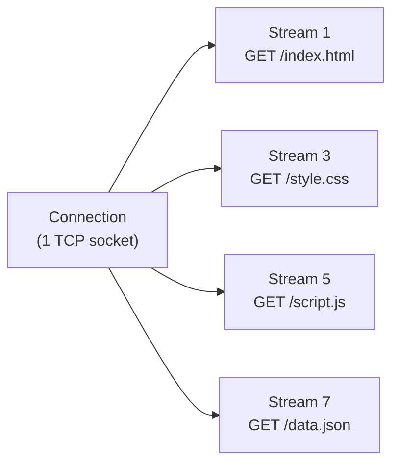

## Overview

HTTP/2 support is provided via the `h2` library. Install the extra:

```bash
uv add "bengal-pounce[h2]"
```

HTTP/2 provides:

- **Stream multiplexing** — Multiple requests over a single TCP connection
- **HPACK header compression** — Reduced overhead for repeated headers
- **Priority signals** — Clients can indicate request priority
- **Server push** — Not implemented (deprecated in most browsers)

## Requirements

HTTP/2 requires TLS with ALPN negotiation:

```bash
pounce myapp:app --ssl-certfile cert.pem --ssl-keyfile key.pem
```

When a client connects with TLS and advertises `h2` via ALPN, Pounce selects the HTTP/2 handler automatically. Clients that only support HTTP/1.1 continue to work.

## Stream Multiplexing

In HTTP/2, multiple requests share a single TCP connection. Each request is a "stream" with its own ID. Pounce creates a separate ASGI scope for each stream, so your application handles each request independently.



All streams are processed concurrently within the worker's asyncio event loop.

## Priority Signals

Pounce parses HTTP Priority Signals (RFC 9218) and uses them internally for stream scheduling. Clients can indicate request urgency and whether responses can be delivered incrementally.

## ASGI Scope

HTTP/2 requests produce a standard ASGI HTTP scope. The `http_version` field is `"2"`:

```python
{
    "type": "http",
    "asgi": {"version": "3.0"},
    "http_version": "2",
    "method": "GET",
    "path": "/",
    "headers": [...],
    ...
}
```

## See Also

- [[docs/protocols/http1|HTTP/1.1]] — Default protocol
- [[docs/protocols/websocket|WebSocket]] — Including WebSocket over HTTP/2
- [[docs/configuration/tls|TLS]] — Setting up TLS for HTTP/2
