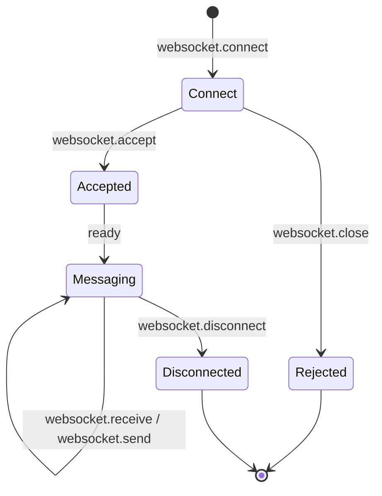

## Overview

WebSocket support is provided via the `wsproto` library. Install the extra:

```bash
uv add "bengal-pounce[ws]"
```

If `wsproto` is missing, WebSocket setup fails with an install hint:
`pip install bengal-pounce[ws]`.

Pounce supports:

- **Standard WebSocket** — Upgrade from HTTP/1.1
- **WebSocket over HTTP/2** — Multiplexed with other HTTP/2 streams when both
  `ws` and `h2` extras are installed
- **Per-message compression** — Via the permessage-deflate extension

## ASGI WebSocket Lifecycle

WebSocket connections follow the ASGI WebSocket spec:



1. **Connect** — `websocket.connect` event received
2. **Accept/Reject** — App sends `websocket.accept` or `websocket.close`
3. **Messages** — Bidirectional `websocket.receive` and `websocket.send`
4. **Disconnect** — `websocket.disconnect` event

```python
async def websocket_app(scope, receive, send):
    assert scope["type"] == "websocket"

    # Wait for connection
    event = await receive()
    assert event["type"] == "websocket.connect"

    # Accept the connection
    await send({"type": "websocket.accept"})

    # Echo messages
    while True:
        event = await receive()
        if event["type"] == "websocket.disconnect":
            break
        await send({
            "type": "websocket.send",
            "text": event.get("text", ""),
        })
```

## WebSocket over HTTP/2

When both `bengal-pounce[h2]` and `bengal-pounce[ws]` are installed, WebSocket
connections can use the HTTP/2 extended CONNECT method (RFC 8441). Treat this as
a separately proven protocol path from HTTP/1 WebSocket support; keep deployment
validation around accept/send/receive/close, stream reset, and missing-extra
behavior.

WebSocket over HTTP/3 is not currently supported.

## Configuration

WebSocket connections share some settings with HTTP connections:

| Setting | Default | Applies To |
|---------|---------|-----------|
| `websocket_compression` | `True` | Enable permessage-deflate compression |
| `websocket_max_message_size` | `10,485,760` (10 MB) | Maximum WebSocket message size |
| `max_connections` | `10,000` | Total connections (HTTP + WebSocket) |
| `shutdown_timeout` | `10.0` | Graceful close during shutdown |

## See Also

- [[docs/protocols/http1|HTTP/1.1]] — WebSocket upgrade source
- [[docs/protocols/http2|HTTP/2]] — WebSocket over H2
- [[docs/reference/api|API Reference]] — ASGI type definitions
