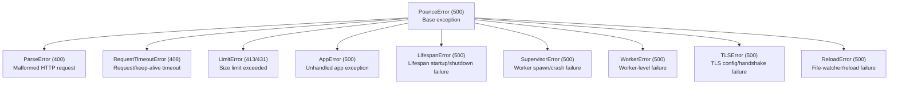

## Error Hierarchy

All pounce errors inherit from `PounceError`. Each error maps to an HTTP status code for automatic error response generation.

## Client Errors

| Error Class | Status | When Raised |
|-------------|--------|-------------|
| `ParseError` | 400 | h11 or the fast parser cannot parse the HTTP request |
| `RequestTimeoutError` | 408 | Request-body progress exceeded `request_timeout`, or response delivery exceeded `write_timeout` |
| `LimitError` | 413 | Body exceeds `max_request_size`. Pass `status_code=431` for header limits (`max_header_size`, `max_headers`). |

## Server Errors

| Error Class | Status | When Raised |
|-------------|--------|-------------|
| `AppError` | 500 | The ASGI application raised an unhandled exception |
| `LifespanError` | 500 | App sent `lifespan.startup.failed` or didn't respond to startup event |
| `SupervisorError` | 500 | Worker spawn failure or crash-restart budget exhausted (max 5 per 60s) |
| `WorkerError` | 500 | Worker-level failure that bubbles up to the supervisor |
| `TLSError` | 500 | TLS certificate not found, invalid, or handshake failure |
| `ReloadError` | 500 | File-watcher failure or worker-restart failure during hot reload |

## Configuration Validation

Configuration errors are raised as `ValueError` (not a `PounceError` subclass) at startup when `ServerConfig` validation fails:

| Error | Cause |
|-------|-------|
| `host must be a non-empty string` | Empty host string |
| `port must be 0-65535` | Port out of valid range |
| `workers must be >= 0` | Negative worker count |
| `ssl_certfile and ssl_keyfile must both be set or both be None` | Only one TLS file provided |
| `log_level must be one of [...]` | Invalid log level string |
| `log_format must be one of [...]` | Invalid log format string |
| `worker_mode must be one of [...]` | Invalid worker mode |
| `http3_enabled requires ssl_certfile and ssl_keyfile` | HTTP/3 without TLS |

## Import Errors

Application import failures raise stdlib exceptions (`ValueError`, `ImportError`, `AttributeError`):

| Error | Cause |
|-------|-------|
| `Could not import module 'X'` | Module not found or import error |
| `Module 'X' has no attribute 'Y'` | App attribute doesn't exist |
| `App 'X' is not callable` | Imported object isn't an ASGI callable |

## Runtime Behavior

Pounce follows the "fail loudly" principle:

- **Configuration errors** — Raised immediately at startup, before binding sockets
- **Import errors** — Raised before any workers start
- **Protocol errors** — Logged and connection closed gracefully
- **Lifespan errors** — Server exits with non-zero status

## See Also

- [[docs/configuration/server-config|ServerConfig]] — Configuration validation rules
- [[docs/troubleshooting|Troubleshooting]] — Common issues and solutions
